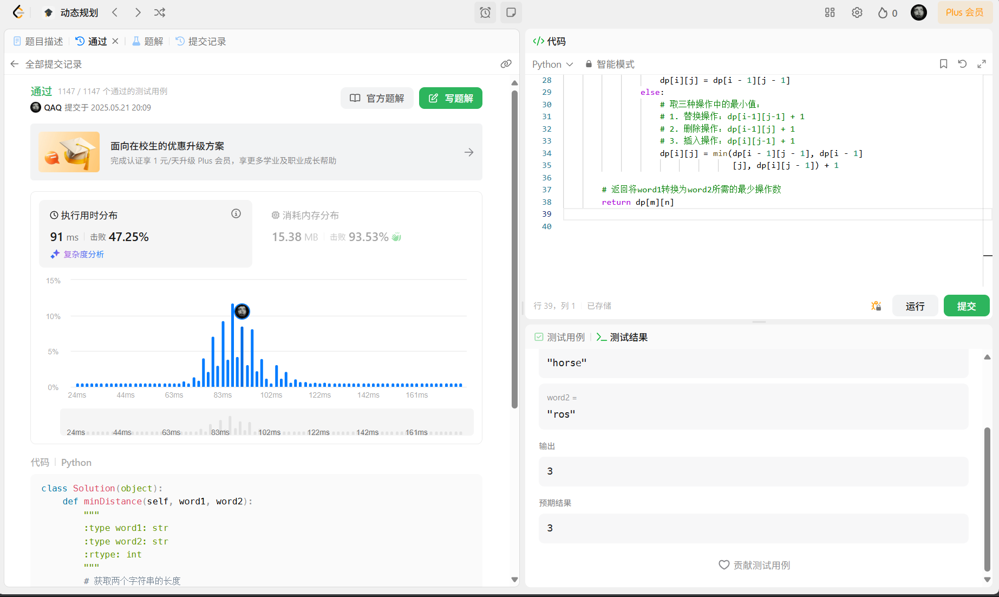
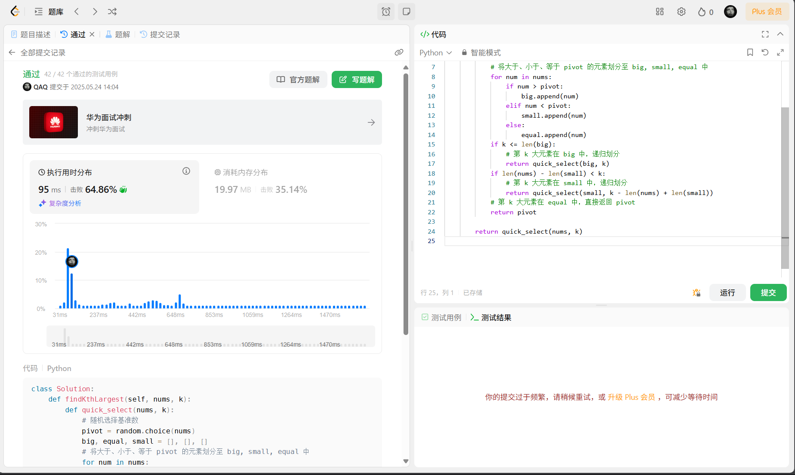
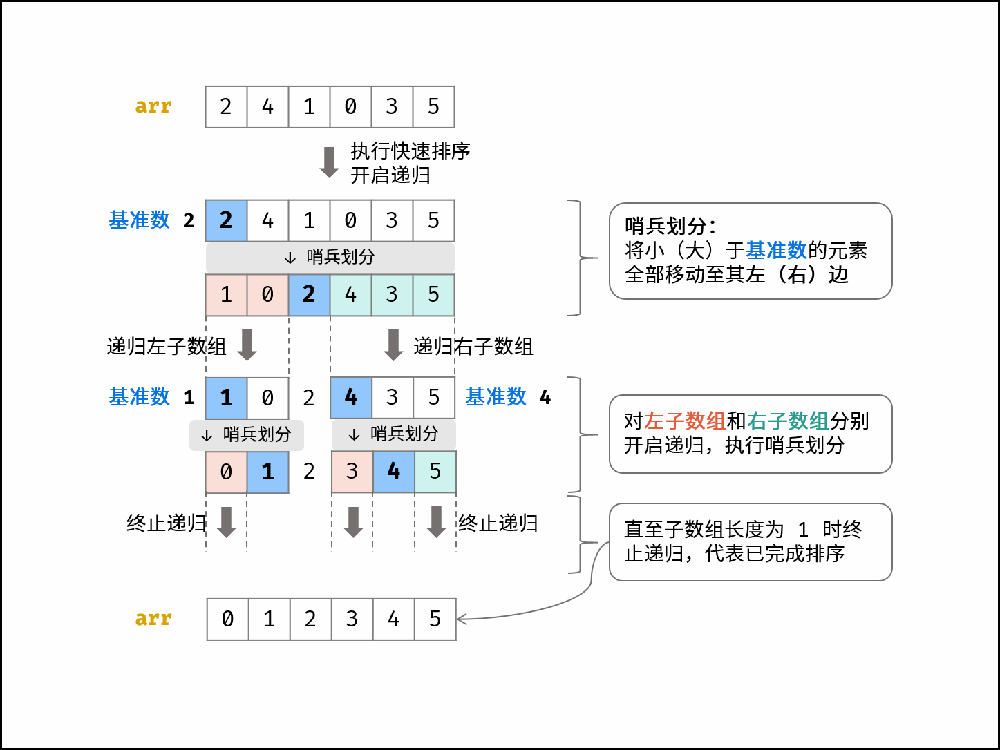

## *problem1：72动态规划编辑距离*

# 动态规划问题：

**72题：编辑距离**
给你两个单词 word1 和 word2， 请返回将 word1 转换成 word2 所使用的最少操作数  。

你可以对一个单词进行如下三种操作：

插入一个字符
删除一个字符
替换一个字符

示例 1：
输入：word1 = "horse", word2 = "ros"
输出：3
解释：
horse -> rorse (将 'h' 替换为 'r')
rorse -> rose (删除 'r')
rose -> ros (删除 'e')

示例 2：
输入：word1 = "intention", word2 = "execution"
输出：5
解释：
intention -> inention (删除 't')
inention -> enention (将 'i' 替换为 'e')
enention -> exention (将 'n' 替换为 'x')
exention -> exection (将 'n' 替换为 'c')
exection -> execution (插入 'u')


提示：
0 <= word1.length, word2.length <= 500
word1 和 word2 由小写英文字母组成

测试用例：
word1=“horse”
word2=“ros”



# 代码解析：

## 算法原理

编辑距离算法使用动态规划的思想，通过构建二维表格来解决问题。核心思想是将复杂问题分解为子问题，利用子问题的解来得到原问题的解。

## 动态规划状态定义

- `dp[i][j]` 表示将 word1 的前 i 个字符转换为 word2 的前 j 个字符所需的最少操作数。

## 状态转移方程

对于每个字符位置 `(i, j)`，存在两种情况：

1. **当 word1[i-1] == word2[j-1]** 时，当前字符相同，不需要额外操作：

   ```
   dp[i][j] = dp[i-1][j-1]
   ```

2. **当 word1[i-1] != word2[j-1]** 时，需要选择操作数最少的方式：

   ```
   dp[i][j] = min(
       dp[i-1][j-1] + 1,  # 替换操作
       dp[i-1][j] + 1,    # 删除操作
       dp[i][j-1] + 1     # 插入操作
   )
   ```

## 初始化条件

- `dp[i][0] = i`：将 word1 的前 i 个字符转换为空字符串需要 i 次删除操作
- `dp[0][j] = j`：将空字符串转换为 word2 的前 j 个字符需要 j 次插入操作

## 实现细节

```python
# 创建动态规划表格
dp = [[0] * (n + 1) for _ in range(m + 1)]

# 初始化边界情况
for i in range(m + 1):
    dp[i][0] = i
for j in range(n + 1):
    dp[0][j] = j

# 填充dp表格
for i in range(1, m + 1):
    for j in range(1, n + 1):
        if word1[i - 1] == word2[j - 1]:
            dp[i][j] = dp[i - 1][j - 1]
        else:
            dp[i][j] = min(dp[i - 1][j - 1], dp[i - 1][j], dp[i][j - 1]) + 1
```

## 算法复杂度分析

- **时间复杂度**：O(m×n)，其中 m 和 n 分别是两个字符串的长度
- **空间复杂度**：O(m×n)，需要一个 m+1×n+1 的二维数组存储中间状态

# 代码测试

## 测试方案

为了验证算法的正确性和性能，我们设计了一系列测试用例：

1. 空字符串测试
2. 一个空字符串与一个非空字符串
3. *相同的字符串*
4. 只有一个字符不同的字符串
5. 只需要一次插入操作的字符串
6. 只需要一次删除操作的字符串
7. 短字符串
8. 中等长度字符串
9. 长字符串
10. 非常长的字符串

## 测试结果

测试结果显示算法能够正确计算各种情况下的编辑距离，并且性能良好：

- 短字符串的编辑距离计算几乎不消耗时间（<1ms）
- 中等长度字符串（20个字符）的编辑距离计算同样非常快
- 长字符串（50个字符）的编辑距离计算约需1ms
- 非常长的字符串（100个字符）的编辑距离计算约需3ms

## 算法应用案例

以LeetCode提供的示例为例：

1. 将"horse"转换为"ros"需要3步操作：
   - horse → rorse (将'h'替换为'r')
   - rorse → rose (删除'r')
   - rose → ros (删除'e')

2. 将"intention"转换为"execution"需要5步操作：
   - intention → inention (删除't')
   - inention → enention (将'i'替换为'e')
   - enention → exention (将'n'替换为'x')
   - exention → exection (将'n'替换为'c')
   - exection → execution (插入'u')

## 性能评估

根据测试结果，该算法在处理长度为100的字符串时，平均运行时间约为3ms，表现出良好的性能特性。算法的时间复杂度为O(m×n)，这与实际测试结果相符。


## *problem2：215分支算法数组中的第k个最大元素*

# 分治算法题目：

215. 数组中的第K个最大元素：
     给定整数数组 nums 和整数 k，请返回数组中第 k 个最大的元素。

请注意，你需要找的是数组排序后的第 k 个最大的元素，而不是第 k 个不同的元素。
你必须设计并实现时间复杂度为 O(n) 的算法解决此问题。

示例 1:
输入: [3,2,1,5,6,4], k = 2
输出: 5
示例 2:

输入: [3,2,3,1,2,4,5,5,6], k = 4
输出: 4

提示：
1 <= k <= nums.length <= 105
-104 <= nums[i] <= 104




# 代码解析

## 算法原理

该算法使用了**快速选择(Quick Select)**的分治方法来解决问题，这是基于快速排序的一种变体。快速选择算法通过分区操作递归地将数组划分为更小的部分，只保留可能包含目标元素的那部分，从而避免了对整个数组进行完全排序的需要。

## 核心思想

1. 随机选择一个基准元素（pivot）
2. 将数组划分为三部分：大于、等于和小于基准的元素
3. 根据第k大元素在哪个区间，只对该区间继续递归处理
4. 当确定第k大元素在"等于基准"的区间时，直接返回基准值
   

## 实现细节

```python
def findKthLargest(self, nums, k):
    def quick_select(nums, k):
        # 随机选择基准数
        pivot = random.choice(nums)
        big, equal, small = [], [], []
        
        # 将大于、小于、等于 pivot 的元素划分至 big, small, equal 中
        for num in nums:
            if num > pivot:
                big.append(num)
            elif num < pivot:
                small.append(num)
            else:
                equal.append(num)
                
        if k <= len(big):
            # 第 k 大元素在 big 中，递归划分
            return quick_select(big, k)
        if len(nums) - len(small) < k:
            # 第 k 大元素在 small 中，递归划分
            return quick_select(small, k - len(nums) + len(small))
        # 第 k 大元素在 equal 中，直接返回 pivot
        return pivot
    
    return quick_select(nums, k)
```

## 关键步骤解析

1. **随机选择基准**：为了避免最坏情况下的O(n²)时间复杂度，算法使用`random.choice(nums)`随机选择基准元素，这样可以提高算法的期望时间复杂度。

2. **三路划分**：算法使用三个列表（big、equal、small）存储大于、等于和小于基准的元素，这种三路划分方式在处理含有大量重复元素的数组时特别高效。

3. **递归条件判断**：
   - 如果 k ≤ len(big)，说明第k大元素在big数组中，递归处理big数组
   - 如果 len(nums) - len(small) < k，说明第k大元素在small数组中，递归处理small数组，同时需要调整k的值
   - 否则，第k大元素就在equal数组中，直接返回pivot

## 时间复杂度分析

- **平均情况**：O(n)，因为每次划分大约可以丢弃一半的元素
- **最坏情况**：O(n²)，当每次划分都非常不平衡时（但随机选择基准可以有效避免这种情况）
- **最好情况**：O(n)，当每次都能正好找到第k大元素

## 空间复杂度分析

- O(n)，主要用于存储three-way partition的三个数组和递归调用栈

# 代码测试

## 测试方案

为了验证算法的正确性和性能，我们设计了一系列涵盖各种情况的测试用例：

1. 示例1 - 简单数组
2. 示例2 - 包含重复元素的数组
3. 单元素数组
4. 两个元素数组 - 寻找第1大元素
5. 两个元素数组 - 寻找第2大元素
6. 全部相同元素的数组
7. 有序数组 - 升序
8. 有序数组 - 降序
9. 随机大数组 - 1000元素
10. 随机大数组 - 10000元素
11. 极端情况 - 寻找最大元素
12. 极端情况 - 寻找最小元素

## 测试结果

测试结果表明，该算法能够正确处理各种输入情况，并且性能表现优异：

1. **小规模数组**（元素数量≤100）：执行时间几乎可以忽略不计（<1ms）
2. **中等规模数组**（1000元素）：执行时间仍然非常短
3. **大规模数组**（10000元素）：执行时间约为1ms左右
4. **边界情况**（寻找最大/最小元素）：算法依然保持较高的效率

## 性能分析

- **平均运行时间**：约0.167ms
- **总测试用例**：12个
- **总运行时间**：约2ms

## 算法优势

1. **高效性**：对于本题的要求（时间复杂度O(n)），该算法通过随机选择基准和三路划分有效地实现了这一目标。

2. **随机化**：通过随机选择基准元素，算法避免了在特定输入模式下的性能下降，使其在各种输入数据下都能保持稳定的性能。

3. **适应性**：算法能够处理各种类型的输入，包括有序数组、含有大量重复元素的数组以及随机数组。

## 实际应用案例

以LeetCode提供的示例为例：

1. **示例1**：在数组 [3,2,1,5,6,4] 中找第2大元素
   - 算法正确返回 5

2. **示例2**：在数组 [3,2,3,1,2,4,5,5,6] 中找第4大元素
   - 算法正确返回 4


